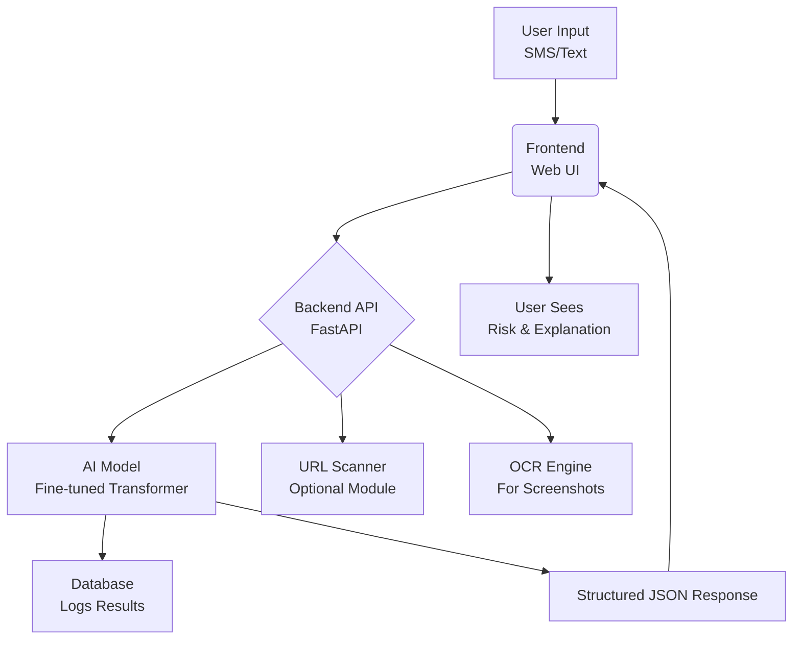

🛡️ AI-Powered Kenyan Phishing Detection System

[](https://opensource.org/licenses/MIT)
[](https://www.python.org/)
[](https://example.com)

A real-time AI system designed to detect and explain phishing attempts targeting Kenyans through SMS, WhatsApp, and email, focusing on localized scams like fake MPesa, KRA, and bank messages.

📖 Table of Contents

- [1. Introduction](#1-introduction)
- [2. Problem Statement](#2-problem-statement)
- [3. Objectives](#3-objectives)
- [4. System Architecture](#4-system-architecture)
- [5. Full Development Stages](#5-full-development-stages)
- [6. AI Model Section](#6-ai-model-section)
- [7. Kenyan-Specific Dataset Guide](#7-kenyan-specific-dataset-guide)
- [8. Backend Guide](#8-backend-guide)
- [9. Frontend Guide](#9-frontend-guide)
- [10. Bonus Features](#10-bonus-features)
- [11. Demo Instructions](#11-demo-instructions)
- [12. Folder Structure](#12-folder-structure)
- [13. Setup & Installation](#13-setup--installation)
- [14. Future Roadmap](#14-future-roadmap)
- [15. License](#15-license)
- [16. Contributors](#16-contributors)

---

1. Introduction

What is this Project?
This is an **AI-powered Phishing Detection System** built to identify fraudulent messages (SMS, WhatsApp, email) that are specifically crafted to trick Kenyans. It uses a fine-tuned language model to analyze text, classify its risk level, and provide a clear, human-readable explanation of why a message is suspicious.

 Why It Matters for Kenya
Kenya has seen an explosive growth in mobile-driven phishing scams:
- **MPesa Scams:** "Confirm your MPesa PIN to receive Ksh 50,000 from a friend."
- **KRA Impersonation:** "You have a pending tax refund! Click here to claim."
- **Bank & WhatsApp Fraud:** "Your KCB account has been locked. Update your details now."
- **Government Impersonation:** "You are a beneficiary of the Hustler Fund. Send your ID."

This project directly addresses this national security threat by leveraging AI to protect millions of users.

Hackathon Relevance
This project falls perfectly under the **"Cybersecurity & Data Protection"** track, demonstrating a practical, scalable application of AI for national security and citizen protection.

2. Problem Statement

Phishing is no longer a generic problem; it's a localized epidemic in Kenya. The Communications Authority of Kenya reports that cybercrimes, primarily phishing, have surged by over 150% in the last two years. The emotional and financial toll is immense.

**Real-World Examples:**
- A student loses their HELB loan to a "HELB Disbursement Form" scam.
- A mama mboga loses a day's earnings to a fake "MPesa Customer Reward" message.
- A salaried employee panics and clicks a link from a "KRA" message, leading to identity theft.

Current solutions are often not tailored to the unique linguistic and contextual nuances of Kenyan scams, which frequently blend English, Kiswahili, and Sheng.

3. Objectives

Our goal is to build a working prototype within a hackathon timeframe that:

- ✅ **Detects Phishing:** Accurately classifies messages into `High Risk (Phishing)`, `Medium Risk (Suspicious)`, and `Low Risk (Safe)`.
- ✅ **Understands Kenyan Context:** Effectively processes messages in English, Kiswahili, and Sheng.
- ✅ **Explains Itself:** Provides clear, actionable reasons for its classification (e.g., "This message creates a false sense of urgency and impersonates Safaricom").
- ✅ **Is User-Friendly:** Offers a simple web or SMS-style interface for easy use.

4. System Architecture



Components:
- **Frontend:** A clean web app that mimics an SMS inbox for intuitive use.
- **Backend (API):** A FastAPI server that handles requests, processes them through the AI model, and returns results.
- **AI Model Pipeline:** A fine-tuned transformer model (e.g., `bert-base-uncased` or `xlm-roberta`) that classifies and explains the input.
- **Dataset Flow:** A curated dataset of Kenyan phishing examples is used for training and continuous improvement.

5. Full Development Stages

 Stage 1 — Planning
- **Tools:** Miro, Figma, Google Docs.
- **Action:** Define scope, user stories, and finalize the tech stack.
- **Output:** A project roadmap and wireframe sketches.

 Stage 2 — Dataset Creation
- **Tools:** Python, Pandas, JSON/CSV.
- **Setup:**
  ```bash
  mkdir dataset
  cd dataset
  # Create kenyan_phishing_data.json
  ```
- **Best Practice:** Manually curate and label at least 20-50 high-quality examples. Balance the classes.
- **Output:** A file `kenyan_phishing_data.json` ready for training.

Stage 3 — Model Training / Fine-Tuning
- **Tools:** Hugging Face `transformers`, `datasets`, `accelerate`.
- **Setup Commands:**
  ```bash
  pip install transformers datasets torch
  python model/train.py
  ```
- **Best Practice:** Start with a pre-trained model and perform few-shot learning or full fine-tuning. Use a GPU for speed.
- **Output:** A fine-tuned model saved as `./model/final_model`.

Stage 4 — Model Evaluation
- **Tools:** Scikit-learn.
- **Action:** Run the model on a held-out test set. Calculate precision, recall, and F1-score.
- **Output:** An evaluation report (e.g., `model/evaluation_report.txt`).

 Stage 5 — Backend API Setup
- **Tools:** FastAPI, Uvicorn, Pydantic.
- **Setup:**
  ```bash
  pip install fastapi uvicorn
  uvicorn backend.main:app --reload
  ```
- **Output:** A running API server at `http://localhost:8000` with `/analyze-message` endpoint.

 Stage 6 — Frontend UI/UX Creation
- **Tools:** HTML, CSS, JavaScript (or Streamlit for rapid prototyping).
- **Action:** Build a simple, responsive UI with a textarea and a "Analyze" button.
- **Output:** A functional frontend that can send requests to the backend.

 Stage 7 — Integration (End-to-End)
- **Action:** Connect the frontend to the backend API. Test the full flow with example messages.
- **Output:** A fully working web application.

 Stage 8 — Optional Features
- **URL Scanner:** Integrate a service like `google-safebrowsing` to check links within messages.
- **OCR Screenshot Extractor:** Use `pytesseract` to extract text from uploaded SMS/WhatsApp screenshots.
- **Gov Impersonation Alerts:** Add a special rule-based flag for messages containing keywords like "GOK," "President's Fund," etc.

 Stage 9 — Deployment
- **Local Demo:** Instructions for running the entire system locally.
- **Cloud Deployment:** Provide a `Dockerfile` and instructions for deploying to Heroku, Railway, or Hugging Face Spaces.

 Stage 10 — Final Production & Hackathon Demo Prep
- **Action:** Polish the UI, prepare the demo script, and test all edge cases.
- **Output:** A ready-to-present hackathon project.

 6. AI Model Section

Model Choice
We use **DistilBERT** or **XLM-RoBERTa Base**.
- **Why:** They offer a great balance between speed, accuracy, and computational cost, which is crucial for a hackathon prototype. XLM-RoBERTa is particularly good with multilingual text.

Fine-Tuning & Prompting
We frame this as a **text classification and explanation** task. The model is fine-tuned on our custom Kenyan dataset.

Classification Labels & Explanation
The model is trained to predict one of three labels and generate a short explanation.

**Example Input/Output:**

- **Input:** `"Congratulations! You have won Ksh 10,000 from Safaricom. To claim, send your MPesa PIN to 211. Offer ends soon."`
- **Output:**
  ```json
  {
    "risk_score": 0.96,
    "classification": "Phishing – High Risk",
    "explanation": "This message creates a false reward, impersonates Safaricom, and urgently requests your secure PIN, which is a major red flag.",
    "recommended_action": "Do not reply or send any information. Delete the message."
  }
  ```

7. Kenyan-Specific Dataset Guide

###Folder Structure
```
/dataset
    ├── kenyan_phishing_data.json  # Main dataset
    ├── raw_examples.txt           # Collected raw text
    └── README.md
```

### Dataset Format (JSON)
The dataset should be a list of dictionaries.

**File:** `kenyan_phishing_data.json`
```json
[
  {
    "text": "URGENT: Your KRA PIN has been suspended. Click http://fake-kra.co.ke to reactivate immediately to avoid penalties.",
    "label": "Phishing – High Risk",
    "explanation": "Creates artificial urgency, uses a suspicious link, and impersonates a government agency (KRA)."
  },
  {
    "text": "Hi John, your Hustler Fund application is ready. Download the form from http://bit.ly/hustler-form",
    "label": "Suspicious – Medium Risk",
    "explanation": "Uses a shortened URL and references a popular government program, but lacks official sender identification."
  },
  {
    "text": "Safaricom: Your data bundle is running low. Dial *544# to buy more data. Thank you.",
    "label": "Legitimate – Safe",
    "explanation": "Uses an official USSD code and standard Safaricom communication style."
  }
]
```

### Sample Entries (20-50 needed)
1.  **MPesa Fake Payment:** "You have received Ksh. 25,000 from James M. To accept, reply with your MPesa PIN. Transaction: PF89H2."
2.  **KRA Scam:** "KRA NOTICE: You have an outstanding tax balance of KES 12,450. Pay now to avoid legal action: https://kra-tax-payment.secure.com"
3.  **WhatsApp Job Scam:** "We are hiring for remote data entry jobs in Nairobi. Earn 25K/week. No experience needed. Start now: wa.me/2547..."
4.  **HELB Scam:** "HELB ALERT: Your loan disbursement is pending verification. Confirm your details here: http://helb-confirm.co.ke"
5.  **Safaricom Impersonation:** "Safaricom: We are upgrading our system. Your line will be disconnected in 24hrs if you don't confirm your details here: http://saf-update.com"

8. Backend Guide (API)

We'll use **FastAPI** for its speed, automatic docs, and simplicity.

### Step-by-Step Setup

1.  **Create `backend/main.py`:**
    ```python
    from fastapi import FastAPI
    from pydantic import BaseModel
    from model.predict import predict_phishing  # Our model function

    app = FastAPI(title="Kenyan Phishing Detector API")

    class MessageRequest(BaseModel):
        message: str

    class AnalysisResult(BaseModel):
        risk_score: float
        classification: str
        explanation: str
        recommended_action: str

    @app.post("/analyze-message", response_model=AnalysisResult)
    async def analyze_message(request: MessageRequest):
        # Call the AI model here
        result = predict_phishing(request.message)
        return AnalysisResult(**result)

    # Run with: uvicorn main:app --reload
    ```

2.  **Connect to Model:** Create a `model/predict.py` that loads the fine-tuned model and runs inference.

3.  **Endpoints:**
    - `POST /analyze-message`: Main endpoint for text analysis.
    - `POST /analyze-url` (Optional): For scanning URLs within messages.
    - `GET /explain/{message_id}` (Optional): To get more detailed explanations.

### Example JSON Response
The API returns a structured JSON object as shown in the AI Model section.

9. Frontend Guide (Web App)

For a hackathon, **Streamlit** is the fastest way to build a presentable UI.

### Wireframe & UI Structure
- **Header:** "🇰🇪 Kenyan Phishing Detector" with Kenyan flag colors.
- **Main Input:** A large textarea with a placeholder: `"Paste a suspicious SMS, WhatsApp, or email message here..."`
- **Button:** A prominent "🛡️ Analyze Message" button.
- **Result Area:** A card that displays the **Risk Level** (with color coding: Red/Orange/Green), the **Explanation**, and the **Recommended Action**.

### Example Component (Streamlit)

**File:** `frontend/app.py`
```python
import streamlit as st
import requests

st.set_page_config(page_title="Kenyan Phishing Detector", page_icon="🛡️")
st.title("🇰🇪 Kenyan Phishing Detector")
st.markdown("Paste a suspicious message below to check if it's a phishing attempt.")

message = st.text_area("Paste SMS / Message here:", height=150)
if st.button("🛡️ Analyze Message"):
    if message:
        with st.spinner('Analyzing...'):
            response = requests.post("http://localhost:8000/analyze-message", json={"message": message})
            if response.status_code == 200:
                result = response.json()
                # Display result with colored box
                risk_color = {"Phishing – High Risk": "red", "Suspicious – Medium Risk": "orange", "Legitimate – Safe": "green"}.get(result['classification'], "gray")
                st.markdown(f"**Classification:** :{risk_color}[{result['classification']}]**")
                st.markdown(f"**Explanation:** {result['explanation']}")
                st.markdown(f"**Recommended Action:** {result['recommended_action']}")
            else:
                st.error("Error calling the API.")
    else:
        st.warning("Please enter a message to analyze.")
```

10. Bonus Features (Optional)

### OCR Screenshot Extractor
- **Tools:** `pytesseract`, `Pillow`.
- **Instruction:** Allow users to upload an image. Use OCR to extract text and then feed it to the main analyzer.
- **Wow Factor:** "You can just take a screenshot of the suspicious message, and we'll tell you if it's a scam."

### Government Impersonation Detector
- **Tools:** Simple keyword matching + AI.
- **Instruction:** Create a list of government entities (KRA, HELB, State House, Hustler Fund). If a message contains these and is classified as suspicious/phishing, add a special alert: "⚠️ This message appears to be impersonating a Kenyan government entity."

### URL Scanner
- **Tools:** Google Safe Browsing API or PhishTank.
- **Instruction:** Extract all URLs from the message and check them against a known phishing database via an API.

11. Demo Instructions (Hackathon Focus)

### How to Demonstrate (5-Minute Pitch)
1.  **(30s) The Hook:** Start with a relatable story. *"Imagine your auntie just got this WhatsApp message..."* Show a real-looking fake MPesa message.
2.  **(1m) The Problem:** Briefly state the scale of phishing in Kenya. Make it emotional and real.
3.  **(2m) The Live Demo:**
    - **Step 1:** Open your web app.
    - **Step 2:** Paste the fake MPesa message.
    - **Step 3:** Click "Analyze."
    - **Step 4:** Show the **RED "High Risk"** alert and the clear explanation.
    - **Step 5 (Wow Moment):** Show a screenshot of a WhatsApp scam, use the OCR feature to extract the text, and analyze it live.
4.  **(1m) The Differentiator:** Explain *why* it's better: "It's built *for Kenya*, by Kenyans. It understands Sheng, it knows our institutions."
5.  **(30s) The Impact & Future:** "This can be integrated with telcos to protect millions. We envision a national phishing alert system."

### Judge "Wow Moments"
- **Live OCR Demo:** Analyzing text from a screenshot.
- **Multilingual Detection:** Show a scam in Kiswahili or Sheng.
- **Clear Explanation:** The model doesn't just say "phishing," it says *why*.

 12. Folder Structure

Create this structure in your repository:

```
/ai-phishing-detector-ke
├── dataset/
│   └── kenyan_phishing_data.json
├── backend/
│   ├── main.py
│   ├── requirements.txt
│   └── (other API files)
├── frontend/
│   └── app.py                 # Streamlit app
├── model/
│   ├── train.py
│   ├── predict.py
│   ├── requirements.txt
│   └── /saved_model           (Generated after training)
├── docs/
│   └── presentation.pptx      # Hackathon slides
├── README.md
└── requirements.txt           # Global requirements (if any)
```

13. Setup & Installation

### Prerequisites
- Python 3.8+
- pip

### Installation & Running

1.  **Clone the repo:**
    ```bash
    git clone https://github.com/yourteam/ai-phishing-detector-ke.git
    cd ai-phishing-detector-ke
    ```

2.  **Setup Backend:**
    ```bash
    cd backend
    pip install -r requirements.txt
    uvicorn main:app --reload
    # API now running on http://localhost:8000
    ```

3.  **Setup Frontend (in a new terminal):**
    ```bash
    cd frontend
    pip install -r requirements.txt
    streamlit run app.py
    # Web app now running on http://localhost:8501
    ```

4.  **Access the Application:** Open your browser to `http://localhost:8501`.

### API Keys (Placeholders)
For bonus features, you might need API keys. Use environment variables.
```bash
# In a .env file
GOOGLE_SAFE_BROWSING_API_KEY=your_key_here
```

14. Future Roadmap

- **Phase 1 (Post-Hackathon):** Improve model accuracy with more data. Develop a mobile app.
- **Phase 2 (Partnerships):** Integrate with Telco APIs (Safaricom, Airtel) to screen messages in real-time.
- **Phase 3 (National Scale):** Create a national phishing threat intelligence database shared with banks and government agencies.
- **Phase 4 (Browser Protection):** Develop a browser extension that warns users before they visit known phishing sites targeting Kenyans.

15. License

This project is licensed under the MIT License - see the [LICENSE](LICENSE) file for details.

16. Contributors

We are a passionate team of developers and data scientists dedicated to solving Kenya's cybersecurity challenges.

| Name | Role | Responsibilities |
| :--- | :--- | :--- |
| [Team Member 1]( https://github.com/MosesCodeX-CS) | Lead Developer/Project Integrator | Oversees full project flow, connects frontend + backend, system architecture
| [Team Member 2]( https://github.com/RickShonko) | Backend Developer | API Development & Integration |
| [Team Member 3]( https://github.com/mosyemi) | Frontend Developer | UI/UX & Demo Design |
---

## 🚀 **Let's Build a Safer Kenya, One Message at a Time.**

**⭐ Star this repo if you find it useful!**
